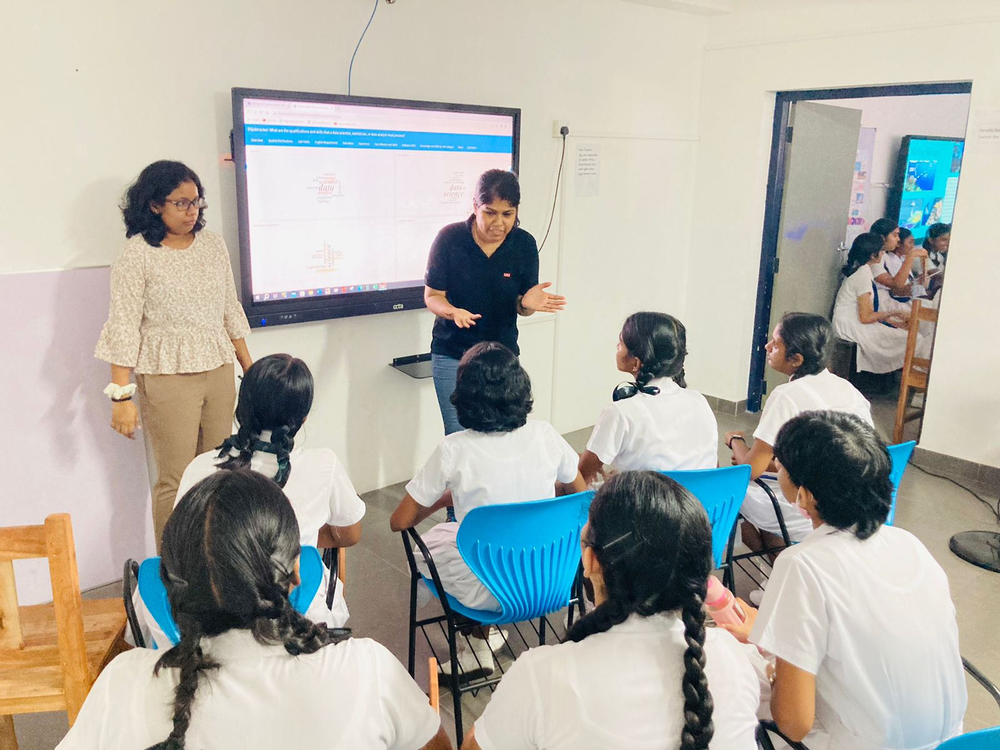
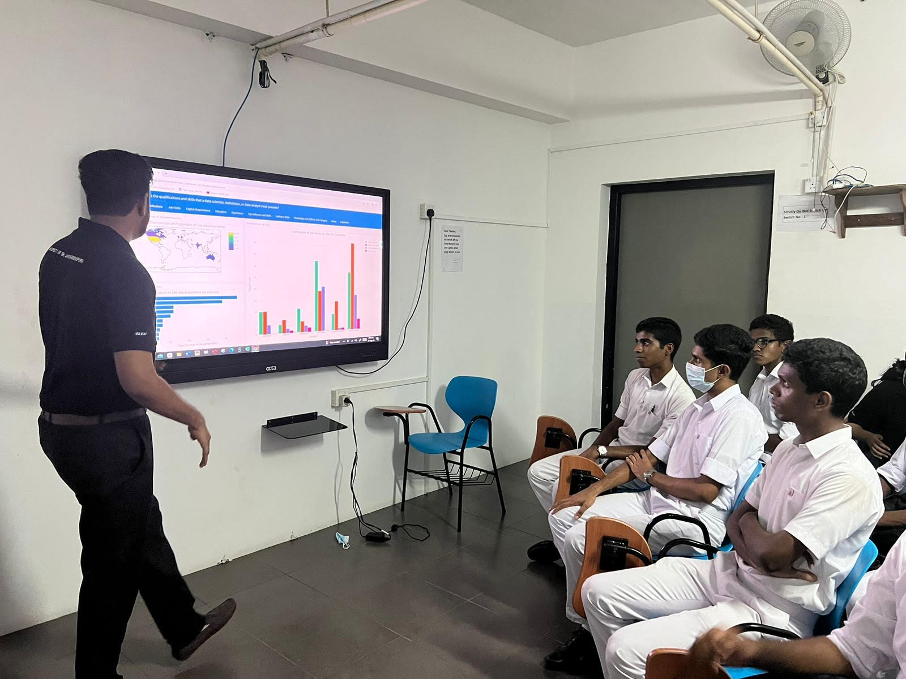
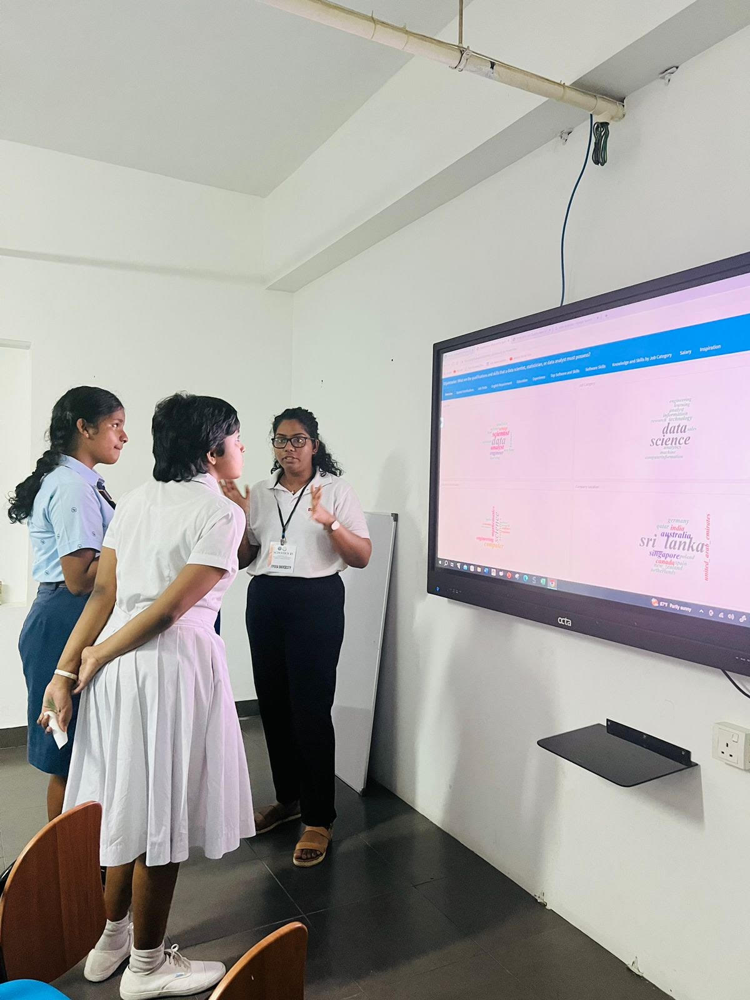
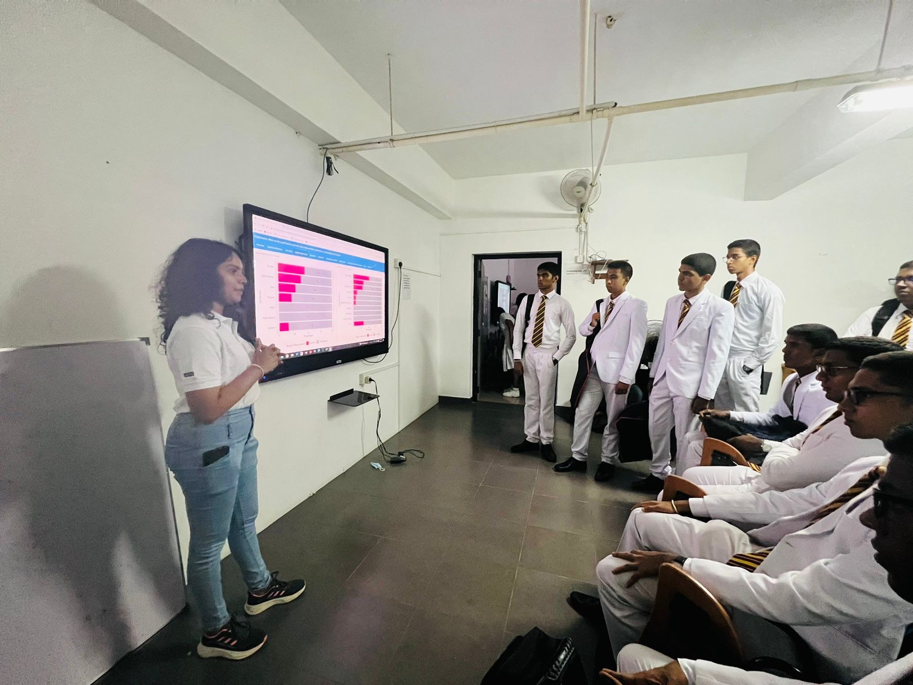

### DSjobtracker: What are the qualifications and skills that a data scientist, statistician, or data analyst must possess?

Since 2020, I have been conducting a survey with my students under the unit STA 474 2.0 Statistical Consultancy to identify key qualifications and skills essential for data scientists, statisticians, and data analyst job roles. Through meticulous analysis of job advertisements, we delved into the core talents that drive success in these dynamic fields. The results were made public using the data visualisation dashboard and an [R package](https://github.com/thiyangt/DSjobtracker).

Recently, we had an unique opportunity to **present our work to school children** at the SCIMATICS_23 exhibition, which was organized by **Musaeus College, Colombo, Sri Lanka**. The exhibition took place from August 10th to August 11th, 2023. 

The event provided a platform for us to share our insights with a diverse group of schoolchildren, fostering an early interest in these fields among the next generation. Overall, the experience was both rewarding and enlightening, as we saw firsthand the potential impact of our research on inspiring future data scientists, statisticians, and analysts.

It was fascinating to witness students' excitement for data science and AI-related subjects. Thank you to all of my students who presented and participated in the project. Let's continue to inspire and pave the way for future data enthusiasts! 

## About the dashboard development

### Data collection

This dashboard was developed using job advertisements gathered between February and June 2023.

We compiled a dataset of 360 job advertisements from various websites within the data science and statistics-related job fields. This dataset encompassed nearly 100 variables associated with job listings, including software qualifications specified in the advertisements, salary ranges, employment types (such as part-time or full-time), and more.

### Dashboard development

The dashboard was written using the R programming language. The dashboard is fully reproducible.

## Please cite the work as follows:

Talagala TS*, Perera HLS, Dissanayake S, Senanayake MB, Atapattu KN, Siriwardene K, Wickramrathne T. DSjobtraker: What are the qualifications and skills that a data scientist, statistician, or data analyst must possess? link: https://github.com/thiyangt/dsjobtraker_dashboard_mc

Corresponding author: Talagala TS

Contact: ttalagala@sjp.ac.lk

### Author contributions:

**Talagala TS:** Idea generation, idea development, initial dashboard format development, dashboard plan development, hosting dashboard, project supervisory

**Perera HLS:** Data cleaning, software and skills/ software skills panel development

**Dissanayake S:** Data cleaning, spatial distribution and salary development

**Senanayake MB:** Data cleaning, overview and inspiration panels development

**Atapattu KN:** Job fields and foft skills panels development

**Siriwardene K:**  English requirement, Knowledge and skills panels development

**Wickramrathne T:** Experience and education panels development

**Copyrights: All rights reserved**

> Here are some pictures we took at the exhibition.

